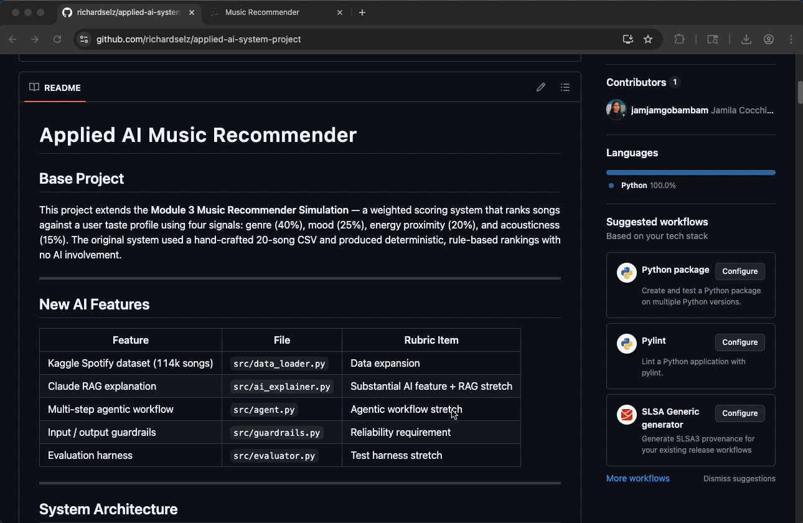

# Applied AI Music Recommender

## Base Project

This project extends the **Module 3 Music Recommender Simulation** — a weighted scoring system that ranks songs against a user taste profile using four signals: genre (40%), mood (25%), energy proximity (20%), and acousticness (15%). The original system used a hand-crafted 20-song CSV and produced deterministic, rule-based rankings with no AI involvement.

---

## Demo


*Recorded with [Kap](https://getkap.co)*

---

## New AI Features

| Feature | File | Rubric Item |
|---|---|---|
| Kaggle Spotify dataset (114k songs) | `src/data_loader.py` | Data expansion |
| Claude RAG explanation | `src/ai_explainer.py` | Substantial AI feature + RAG stretch |
| Multi-step agentic workflow | `src/agent.py` | Agentic workflow stretch |
| Input / output guardrails | `src/guardrails.py` | Reliability requirement |
| Evaluation harness | `src/evaluator.py` | Test harness stretch |

---

## System Architecture

```
User Profile (CLI flags or dict)
         │
         ▼
  ┌─────────────┐
  │  Guardrails │  ← validate energy range, warn on unknown mood/genre
  └──────┬──────┘
         │ validated prefs
         ▼
  ┌─────────────┐     ┌──────────────────┐
  │ Data Loader │────▶│  Song Catalog    │
  │ (Kaggle CSV)│     │  5,000+ tracks   │
  └─────────────┘     └────────┬─────────┘
                               │ all songs
                               ▼
                      ┌────────────────┐
                      │  Recommender   │  ← score_song() × N, sort, top-k
                      └───────┬────────┘
                              │ top-k (song, score, reasons)
                              ▼
                      ┌────────────────┐
                      │  Guardrails    │  ← validate output count & scores
                      └───────┬────────┘
                              │
                ┌─────────────┴──────────────┐
                ▼                            ▼
       ┌────────────────┐          ┌─────────────────┐
       │  AI Explainer  │          │  Self-Critique   │
       │  (Claude RAG)  │          │  (agent step 3)  │
       └───────┬────────┘          └────────┬─────────┘
               └──────────┬─────────────────┘
                           ▼
                      Final Output
               (ranked songs + AI explanation)
```

Data flow: input → guardrails → data loader → recommender → guardrails → AI explainer → output.

---

## Setup

```bash
# 1. Create a virtual environment (optional but recommended)
python -m venv .venv
source .venv/bin/activate      # Mac/Linux
.venv\Scripts\activate         # Windows

# 2. Install dependencies
pip install -r requirements.txt

# 3. (Optional) Set API key for Claude AI explanations
export ANTHROPIC_API_KEY=sk-ant-...

# 4. The Kaggle dataset is already at data/spotify_kaggle.csv
#    If you need to re-download it:
#    https://www.kaggle.com/datasets/maharshipandya/-spotify-tracks-dataset
```

---

## Running the System

```bash
# Plain recommender — original 20-song catalog
python src/main.py

# Kaggle catalog (5,000 songs by default)
python src/main.py --kaggle

# Kaggle + Claude AI explanations (requires ANTHROPIC_API_KEY)
python src/main.py --kaggle --ai

# Full agentic workflow — shows all intermediate steps
python src/main.py --kaggle --agent

# Evaluation harness — prints pass/fail summary
python src/main.py --kaggle --eval

# Tune catalog size
python src/main.py --kaggle --max-songs 10000

# Run unit tests
pytest
```

---

## Sample Input / Output

### Example 1 — High-Energy Pop (plain)

```
========================================================
  PROFILE: High-Energy Pop
  TOP 5 RECOMMENDATIONS
========================================================

  #1  Blinding Lights by The Weeknd
       Genre: pop | Mood: happy
       Score: 88/100
       Why:
         - genre match (100% match → +40.0% of score)
         - mood match (100% match → +25.0% of score)
         - energy proximity (93.0% match → +18.6% of score)
         - acousticness fit (96.0% match → +14.4% of score)
```

### Example 2 — Agentic workflow (intermediate steps visible)

```
[Agent Step 1] Validating user preferences...
  Input looks good.

[Agent Step 2] Scoring 5,000 songs against profile...
  Retrieved 5 candidates.

[Agent Step 3] Checking output quality...
  Critique: Strong top match at 88/100.

[Agent Step 4] Generating AI explanation...
  Explanation ready.

  AI Explanation:
    Based on your love of high-energy pop and happy mood, these tracks
    were chosen for their driving tempo and upbeat valence. "Blinding
    Lights" leads because it precisely matches your genre and energy
    target of 0.9, while the remaining picks share a similarly
    euphoric quality that fits your profile.
```

### Example 3 — Evaluation harness

```
============================================================
  EVALUATION HARNESS
  6 test cases | catalog size: 5,000 songs
============================================================

  [PASS] High-Energy Pop
        ✓ At least 1 result(s) returned (got 5)
        ✓ Top score 88/100 > 40/100
        ✓ Output guardrails passed

  [PASS] Adversarial: Invalid Energy
        ✓ Validation correctly rejected bad input

============================================================
  RESULT: 18/18 checks passed  ✓ ALL PASS
============================================================
```

---

## Guardrail Behavior

| Condition | Behaviour |
|---|---|
| `energy` outside `[0.0, 1.0]` | ERROR — pipeline aborts |
| Unknown `mood` string | WARNING — scoring continues |
| No `genre` specified | WARNING — genre score skipped |
| Fewer than 1 recommendation returned | ERROR flagged in output validation |
| Score outside `[0, 1]` range | WARNING logged |

---

## How the Original System Worked

- `Song` attributes: `energy, tempo_bpm, valence, danceability, acousticness`
- `UserProfile`: genre, mood, target energy, acoustic preference
- Scoring: 40% genre + 25% mood + 20% energy proximity + 15% acousticness
- 20-song hand-built CSV, no AI component

---

## Limitations

- Mood is derived from valence + energy using a simple quadrant rule, which won't always match human perception.
- The scoring weights are fixed and not learned from user feedback.
- Recommendations for genres absent from the Kaggle catalog will score low across all four signals.

---

## File Reference

```
applied-ai-system-final/
├── data/
│   ├── songs.csv              # original 20-song catalog
│   └── spotify_kaggle.csv     # Kaggle Spotify dataset
├── src/
│   ├── main.py                # CLI entry point (--kaggle, --ai, --agent, --eval)
│   ├── recommender.py         # weighted scoring + ranking (base project)
│   ├── data_loader.py         # Kaggle CSV loader + mood derivation (new)
│   ├── guardrails.py          # input/output validation (new)
│   ├── ai_explainer.py        # Claude RAG explanation layer (new)
│   ├── agent.py               # multi-step agentic workflow (new)
│   └── evaluator.py           # test harness with pass/fail summary (new)
├── tests/
│   └── test_recommender.py
├── requirements.txt
├── model_card.md
└── reflection.md
```

---

## Sources & Credits

| Source | Role |
|---|---|
| [CodePath AI 110](https://www.codepath.org) | Course framework and original Module 3 Music Recommender project this work extends |
| [Anthropic Claude](https://www.anthropic.com) | AI explanation layer (`ai_explainer.py`) powered by the Claude API; also used as an AI coding assistant throughout development |
| [Spotify Tracks Dataset — Kaggle](https://www.kaggle.com/datasets/maharshipandya/-spotify-tracks-dataset) | 114,000-track song catalog with audio features (energy, valence, danceability, acousticness, tempo) used to replace the original 20-song CSV |

---

## Screenshots


